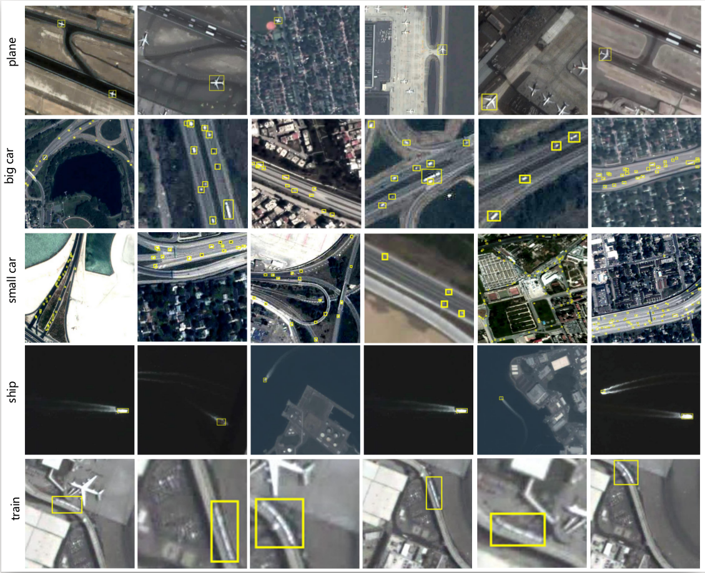
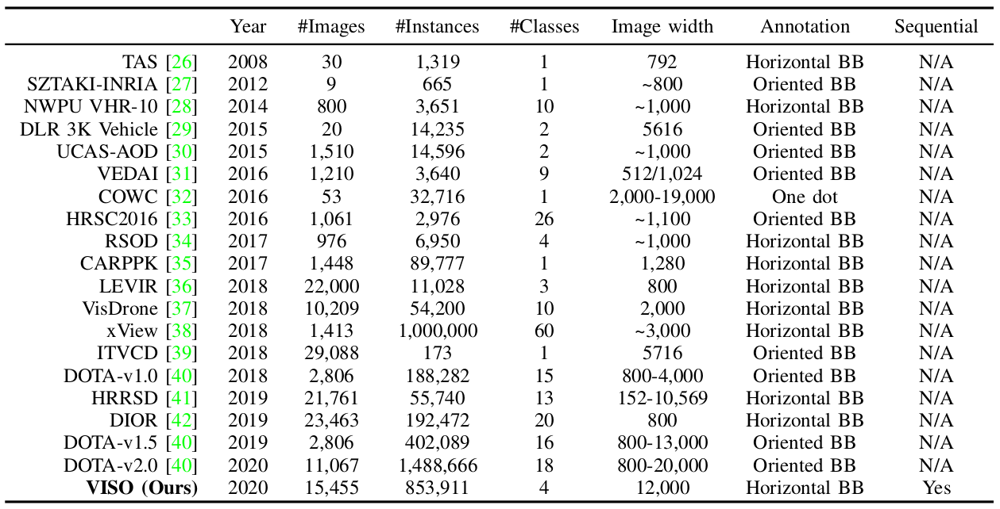
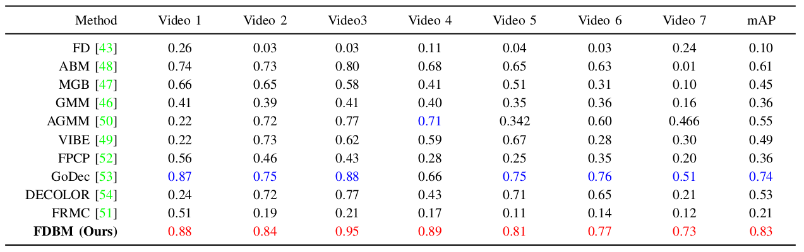
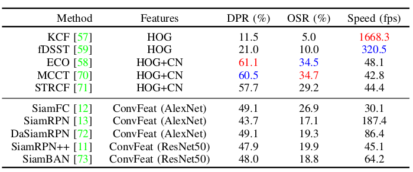
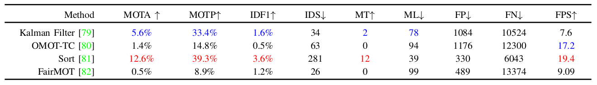
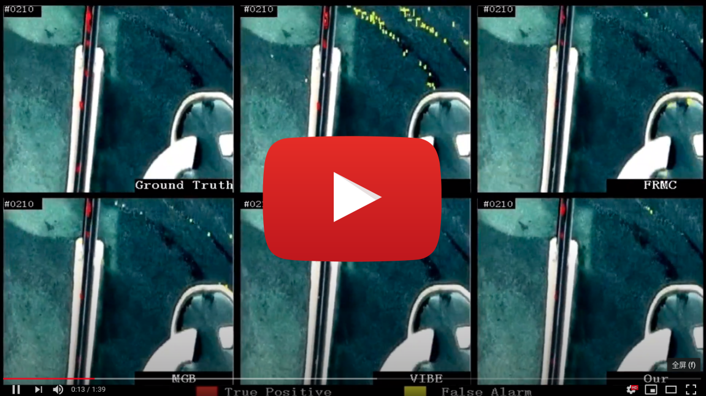
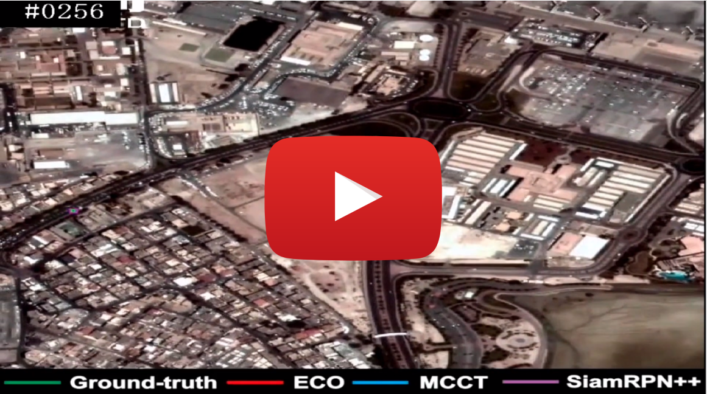

# Detecting and Tracking Small and Dense Moving Objects in Satellite Videos: A Benchmark

This is the official website of the **VISO** (VIdeo Satellite Objects) dataset. [[Download](https://pan.baidu.com/s/1PRz4aRfiUGulLrTRWcSVuQ)]

### (1) Data

This dataset is a large-scale dataset for moving object detection and tracking in satellite videos, which consists of 40 
satellite videos captured by [Jilin-1 satellite platforms](http://mall.charmingglobe.com/videoIndex.html). Each image has
a resolution of 12000x5000 and contains a great number of objects with different scales. 
Four common types of vechicles, including plane, car, ship, and train, are manually-labeled. 
A total of 853,911 instances are labeled by axis-aligned bounding boxes.

  

  

### (2) Benchmark
We also build a new satellite video benchmark to fairly and extensively evaluate the performance of existing methods in 
several sub-tasks, including moving object detection, single-object tracking, and multi-object tracking.

- Moving Object Detection:

  

- Single Object Tracking:

  

- Multiple Object Tracking:

  

### (3) Demo

  

  

